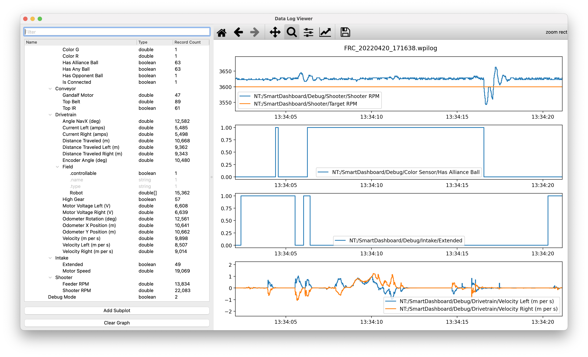

StuyPulse Data Log Viewer
=========================

Application for visualizing [WPILib Data Log](https://docs.wpilib.org/en/stable/docs/software/telemetry/datalog.html) files.



Develop
-------

```
python3 -m venv venv
source venv/bin/activate
pip install -r requirements.txt
```

Build
-----

```
pyinstaller 'Data Log Viewer.spec'
```
